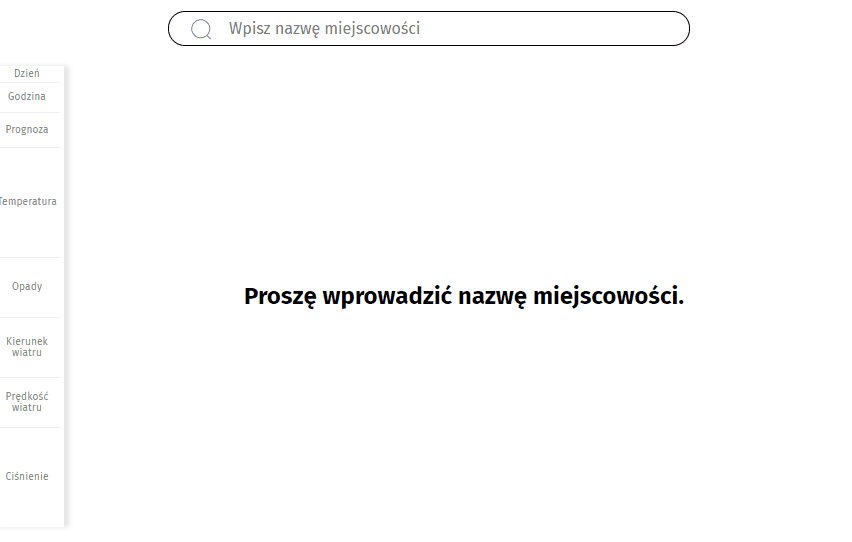

# Hourly Weather Forecast Widget

My Hourly Weather Forecast Widget allows you check current weather for 48 hours. The appearance of weather is based on 'onet.pl'.

## Where can I find this Hourly Weather Forecast Widget?

Below I attached link to this website:

[Hourly Weather Forecast Widget](https://anetaszynal.github.io/hourly_weather_forecast/)

## Now, see how to use

## Run project
- `npm install`
- `npm start`

## Description

You will find there:

- a place to enter or change the city name
- 48 tiles with hour weather
- legend to the weather
- slider to move further tiles with weather

**Technologies, libraries and methodologies used:**

- HTML
- CSS
- Styled components
- JavaScript (ECMAScript 2020)
- React.js
- React Hooks (also custom hooks)
- JSX

## How to use?

1. Enter the name of the city for which you want to check the weather,
2. Press Enter
3. Check the weather,
4. Use slider to check all weather,
5. You can change the name of city and again check weather.

This project was bootstrapped with Create React App.
